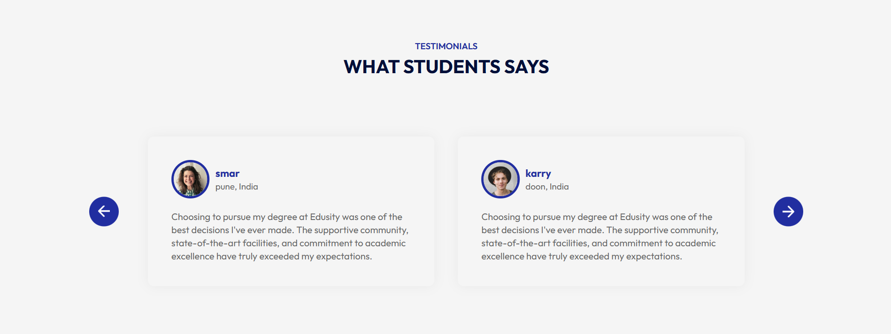

# 🎓 Edusity - Education Website

Edusity is a modern, responsive educational website built with **React.js**.  
It provides sections for About, Campus, Programs, Testimonials, Contact, and more.  

---

## 🚀 Features
- Responsive design (mobile, tablet, desktop)  
- Reusable React components  
- Styled with CSS  
- Smooth UI/UX  

---

## 🛠️ Installation & Setup

1. Clone the repository:
   ```bash
   git clone https://github.com/paraspasbola512/Edusity
   cd edusity

2. Install dependencies:

npm install


3. Start the development server:

npm start


4. Build for production:

npm run build

📸 Screenshots


### 📚 other sections





👨‍💻 Author
GitHub: @paraspasbola512


---


