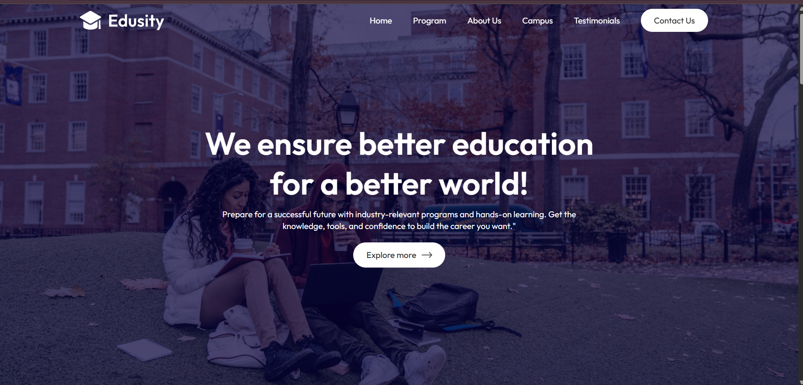

# 🎓 Edusity - Education Website

Edusity is a modern, responsive educational website built with **React.js**.  
It provides sections for About, Campus, Programs, Testimonials, Contact, and more.  

---

## 🚀 Features
- Responsive design (mobile, tablet, desktop)  
- Reusable React components  
- Styled with CSS  
- Smooth UI/UX  

---

## 🛠️ Installation & Setup

1. Clone the repository:
   ```bash
   git clone https://github.com/paraspasbola512/Edusity
   cd edusity

2. Install dependencies:

npm install


3. Start the development server:

npm start


4. Build for production:

npm run build

📸 Screenshots


Programs Section

🌍 Live Demo

👉 Click here to view live site

📌 Tech Stack

React.js

CSS3

Git & GitHub

Vercel / Netlify (for deployment)

👨‍💻 Author

Your Name

GitHub: @your-username


---

⚡ Next step:  
Do you want me to **write and add this `README.md` file directly in your project**, or do you just want to copy-paste this template yourself?
